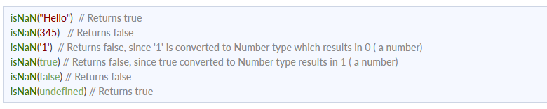

# Yangi talabalar uchun JavaScript intervyu savollari
## 1. Javascriptda qanday ma'lumotlar turlari mavjud?
JavaScript o'zgaruvchisining turini bilish uchun typeof operatoridan foydalanishimiz mumkin.

### 1. Primitiv tiplar

- String - U bir qator belgilarni ifodalaydi va tirnoq bilan yoziladi. Satr bitta yoki ikkita tirnoq yordamida ifodalanishi mumkin.

Misol:

var str = "Vivek Singh Bisht"; //using double quotes
var str2 = 'John Doe'; //using single quotes
- Number- Bu raqamni ifodalaydi va o'nli yoki o'nli kasrlarsiz yozilishi mumkin.
Misol:

var x = 3; //without decimal
var y = 3.6; //with decimal

- BigInt - Ushbu ma'lumotlar turi Raqamli ma'lumotlar turi chegarasidan yuqori bo'lgan raqamlarni saqlash uchun ishlatiladi. U katta butun sonlarni saqlashi mumkin va butun son harfiga “n” qoʻshish orqali ifodalanadi.

Misol:

var bigInteger =  234567890123456789012345678901234567890;
Mantiqiy - Bu mantiqiy ob'ektni ifodalaydi va faqat ikkita qiymatga ega bo'lishi mumkin: rost yoki noto'g'ri. Booleanlar odatda shartli sinov uchun ishlatiladi.

Misol:

var a = 2;

var b =  3;

var c =  2;

(a == b) // returns false

(a == c) //returns true

Aniqlanmagan - o'zgaruvchi e'lon qilingan, lekin tayinlanmagan bo'lsa, u undefined qiymatiga ega va uning turi ham aniqlanmagan.

Misol:

var x; // value of x is undefined
var y = undefined; // we can also set the value of a variable as undefined
Null - u mavjud bo'lmagan yoki noto'g'ri qiymatni ifodalaydi.
Misol:

var z = null;
Symbol - Bu javascriptning ES6 versiyasida kiritilgan yangi ma'lumotlar turi. U anonim va noyob qiymatni saqlash uchun ishlatiladi.
Misol:

- var symbol1 = Symbol('symbol');
- ibtidoiy turlarning turlari :
- typeof "John Doe" // Returns "string"
- typeof 3.14 // Returns "number"
- typeof true // Returns "boolean"
- typeof 234567890123456789012345678901234567890n // Returns bigint 

- typeof undefined // Returns "undefined"
- typeof null // Returns "object" (kind of a bug in JavaScript)
- typeof Symbol('symbol') // Returns Symbol 

### 2. Primitiv bo'lmagan turlar

Primitiv ma'lumotlar turlari faqat bitta qiymatni saqlashi mumkin. Bir nechta va murakkab qiymatlarni saqlash uchun primitiv bo'lmagan ma'lumotlar turlari qo'llaniladi.
Ob'ekt - ma'lumotlar to'plamini saqlash uchun ishlatiladi.
Misol:
// Collection of data in key-value pairs

var obj1 = {
   x:  43,
   y:  "Hello world!",
   z: function(){
      return this.x;
   }
}
      
// Collection of data as an ordered list
     
var array1 = [5, "Hello", true, 4.1]; 

## 2. Javascriptda Hoistingni tushuntiring.
Yuk ko'tarish JavaScript-ning standart xatti-harakati bo'lib, unda barcha o'zgaruvchilar va funksiya deklaratsiyasi tepaga ko'chiriladi.

Bu shuni anglatadiki, o'zgaruvchilar va funktsiyalar qayerda e'lon qilinganidan qat'i nazar, ular qamrovning yuqori qismiga ko'chiriladi. Qamrov ham mahalliy, ham global bo'lishi mumkin.

### 1-misol:

hoistedVariable = 3;
console.log(hoistedVariable); // outputs 3 even when the variable is declared after it is initialized	
var hoistedVariable;
### 2-misol:

hoistedFunction();  // Outputs " Hello world! " even when the function is declared after calling

function hoistedFunction(){ 
  console.log(" Hello world! ");
} 
### 3-misol:

// Hoisting takes place in the local scope as well
function doSomething(){
  x = 33;
  console.log(x);
  var x;
} 
doSomething(); // "x" mahalliy o'zgaruvchisi mahalliy doirada ko'tarilganligi sababli 33 chiqadi

Eslatma - O'zgaruvchilarni ishga tushirishlar ko'tarilmaydi, faqat o'zgaruvchan deklaratsiyalar ko'tariladi:
var x;

console.log(x); // Outputs "undefined" since the initialization of "x" is not hoisted
x = 23; 

Eslatma - Ko'tarilishning oldini olish uchun siz kodning tepasida "qat'iy foydalanish" dan foydalanib JavaScript-ni qattiq rejimda ishga tushirishingiz mumkin:

"use strict";
x = 23; // Gives an error since 'x' is not declared
var x; 

## 3. Nima uchun javascriptda “debugger” so‘zini ishlatamiz?
Kodni disk raskadrovka qilish uchun brauzer uchun tuzatuvchi faollashtirilgan bo'lishi kerak. O'rnatilgan tuzatuvchilarni yoqish va o'chirish mumkin, bu esa foydalanuvchidan nosozliklar haqida xabar berishni talab qiladi. Kodning qolgan qismi disk raskadrovka paytida keyingi qatorga o'tishdan oldin bajarilishini to'xtatishi kerak.

- String coercion

## 8. JavaScript-da NaN xossasi nima?
NaN xususiyati "Raqam emas" qiymatini ifodalaydi. Bu qonuniy raqam bo'lmagan qiymatni bildiradi.

typeof of NaN raqamni qaytaradi .

Qiymat NaN ekanligini tekshirish uchun isNaN() funksiyasidan foydalanamiz,

## 9. Qiymat bo'yicha o'tgan va mos yozuvlar bo'yicha o'tganlarni tushuntiring.
JavaScript-da ibtidoiy ma'lumotlar turlari qiymat bo'yicha, noaniq ma'lumotlar turlari esa mos yozuvlar bo'yicha uzatiladi.

Qiymat bo'yicha o'tgan va mos yozuvlar orqali o'tgan tushunish uchun biz o'zgaruvchini yaratganimizda va unga qiymat berganimizda nima sodir bo'lishini tushunishimiz kerak,

var x = 2;

Yuqoridagi misolda biz x o'zgaruvchisini yaratdik va unga "2" qiymatini berdik. Orqa fonda "=" (tayinlash operatori) xotirada bir oz joy ajratadi, "2" qiymatini saqlaydi va ajratilgan xotira maydonining o'rnini qaytaradi. Shuning uchun, yuqoridagi koddagi x o'zgaruvchisi to'g'ridan-to'g'ri 2 qiymatini ko'rsatish o'rniga xotira maydonining joylashgan joyiga ishora qiladi.

Assign operatori ibtidoiy va ibtidoiy bo'lmagan ma'lumotlar turlari bilan ishlaganda o'zini boshqacha tutadi,

Assign operatori ibtidoiy turlar bilan ishlaydi:

