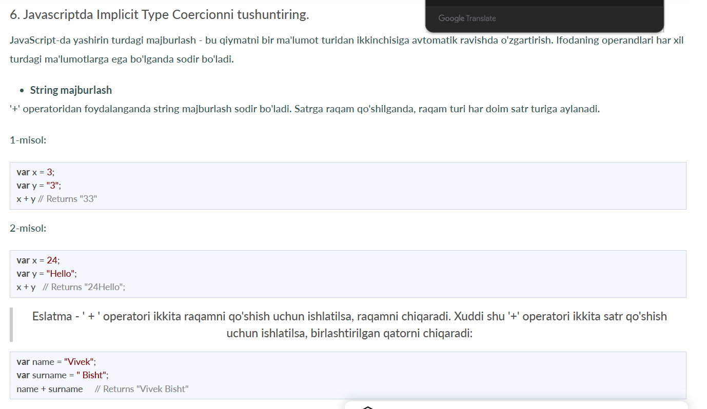

# Yangi talabalar uchun JavaScript intervyu savollari
## 1. Javascriptda qanday ma'lumotlar turlari mavjud?
JavaScript o'zgaruvchisining turini bilish uchun typeof operatoridan foydalanishimiz mumkin.

### 1. Primitiv tiplar

- String - U bir qator belgilarni ifodalaydi va tirnoq bilan yoziladi. Satr bitta yoki ikkita tirnoq yordamida ifodalanishi mumkin.

Misol:

var str = "Vivek Singh Bisht"; //using double quotes
var str2 = 'John Doe'; //using single quotes
- Number- Bu raqamni ifodalaydi va o'nli yoki o'nli kasrlarsiz yozilishi mumkin.
Misol:

var x = 3; //without decimal
var y = 3.6; //with decimal

- BigInt - Ushbu ma'lumotlar turi Raqamli ma'lumotlar turi chegarasidan yuqori bo'lgan raqamlarni saqlash uchun ishlatiladi. U katta butun sonlarni saqlashi mumkin va butun son harfiga “n” qoʻshish orqali ifodalanadi.

Misol:

var bigInteger =  234567890123456789012345678901234567890;
Mantiqiy - Bu mantiqiy ob'ektni ifodalaydi va faqat ikkita qiymatga ega bo'lishi mumkin: rost yoki noto'g'ri. Booleanlar odatda shartli sinov uchun ishlatiladi.

Misol:

var a = 2;

var b =  3;

var c =  2;

(a == b) // returns false

(a == c) //returns true

Aniqlanmagan - o'zgaruvchi e'lon qilingan, lekin tayinlanmagan bo'lsa, u undefined qiymatiga ega va uning turi ham aniqlanmagan.

Misol:

var x; // value of x is undefined
var y = undefined; // we can also set the value of a variable as undefined
Null - u mavjud bo'lmagan yoki noto'g'ri qiymatni ifodalaydi.
Misol:

var z = null;
Symbol - Bu javascriptning ES6 versiyasida kiritilgan yangi ma'lumotlar turi. U anonim va noyob qiymatni saqlash uchun ishlatiladi.
Misol:

- var symbol1 = Symbol('symbol');
- ibtidoiy turlarning turlari :
- typeof "John Doe" // Returns "string"
- typeof 3.14 // Returns "number"
- typeof true // Returns "boolean"
- typeof 234567890123456789012345678901234567890n // Returns bigint 

- typeof undefined // Returns "undefined"
- typeof null // Returns "object" (kind of a bug in JavaScript)
- typeof Symbol('symbol') // Returns Symbol 

### 2. Primitiv bo'lmagan turlar

Primitiv ma'lumotlar turlari faqat bitta qiymatni saqlashi mumkin. Bir nechta va murakkab qiymatlarni saqlash uchun primitiv bo'lmagan ma'lumotlar turlari qo'llaniladi.
Ob'ekt - ma'lumotlar to'plamini saqlash uchun ishlatiladi.
Misol:
// Collection of data in key-value pairs

var obj1 = {
   x:  43,
   y:  "Hello world!",
   z: function(){
      return this.x;
   }
}
      
// Collection of data as an ordered list
     
var array1 = [5, "Hello", true, 4.1]; 

## 2. Javascriptda Hoistingni tushuntiring.
Yuk ko'tarish JavaScript-ning standart xatti-harakati bo'lib, unda barcha o'zgaruvchilar va funksiya deklaratsiyasi tepaga ko'chiriladi.

Bu shuni anglatadiki, o'zgaruvchilar va funktsiyalar qayerda e'lon qilinganidan qat'i nazar, ular qamrovning yuqori qismiga ko'chiriladi. Qamrov ham mahalliy, ham global bo'lishi mumkin.

### 1-misol:

hoistedVariable = 3;
console.log(hoistedVariable); // outputs 3 even when the variable is declared after it is initialized	
var hoistedVariable;
### 2-misol:

hoistedFunction();  // Outputs " Hello world! " even when the function is declared after calling

function hoistedFunction(){ 
  console.log(" Hello world! ");
} 
### 3-misol:

// Hoisting takes place in the local scope as well
function doSomething(){
  x = 33;
  console.log(x);
  var x;
} 
doSomething(); // "x" mahalliy o'zgaruvchisi mahalliy doirada ko'tarilganligi sababli 33 chiqadi

Eslatma - O'zgaruvchilarni ishga tushirishlar ko'tarilmaydi, faqat o'zgaruvchan deklaratsiyalar ko'tariladi:
var x;

console.log(x); // Outputs "undefined" since the initialization of "x" is not hoisted
x = 23; 

Eslatma - Ko'tarilishning oldini olish uchun siz kodning tepasida "qat'iy foydalanish" dan foydalanib JavaScript-ni qattiq rejimda ishga tushirishingiz mumkin:

"use strict";
x = 23; // Gives an error since 'x' is not declared
var x; 

## 3. Nima uchun javascriptda “debugger” so‘zini ishlatamiz?
Kodni disk raskadrovka qilish uchun brauzer uchun tuzatuvchi faollashtirilgan bo'lishi kerak. O'rnatilgan tuzatuvchilarni yoqish va o'chirish mumkin, bu esa foydalanuvchidan nosozliklar haqida xabar berishni talab qiladi. Kodning qolgan qismi disk raskadrovka paytida keyingi qatorga o'tishdan oldin bajarilishini to'xtatishi kerak.

- String coercion

## 8. JavaScript-da NaN xossasi nima?
NaN xususiyati "Raqam emas" qiymatini ifodalaydi. Bu qonuniy raqam bo'lmagan qiymatni bildiradi.

typeof of NaN raqamni qaytaradi .

Qiymat NaN ekanligini tekshirish uchun isNaN() funksiyasidan foydalanamiz,

## 9. Qiymat bo'yicha o'tgan va mos yozuvlar bo'yicha o'tganlarni tushuntiring.
JavaScript-da ibtidoiy ma'lumotlar turlari qiymat bo'yicha, noaniq ma'lumotlar turlari esa mos yozuvlar bo'yicha uzatiladi.

Qiymat bo'yicha o'tgan va mos yozuvlar orqali o'tgan tushunish uchun biz o'zgaruvchini yaratganimizda va unga qiymat berganimizda nima sodir bo'lishini tushunishimiz kerak,

var x = 2;

Yuqoridagi misolda biz x o'zgaruvchisini yaratdik va unga "2" qiymatini berdik. Orqa fonda "=" (tayinlash operatori) xotirada bir oz joy ajratadi, "2" qiymatini saqlaydi va ajratilgan xotira maydonining o'rnini qaytaradi. Shuning uchun, yuqoridagi koddagi x o'zgaruvchisi to'g'ridan-to'g'ri 2 qiymatini ko'rsatish o'rniga xotira maydonining joylashgan joyiga ishora qiladi.

Assign operatori ibtidoiy va ibtidoiy bo'lmagan ma'lumotlar turlari bilan ishlaganda o'zini boshqacha tutadi,

Assign operatori ibtidoiy turlar bilan ishlaydi:

##  10. JavaScript-da darhol chaqiriladigan funksiya nima?
Darhol chaqiriladigan funktsiya (IIFE deb nomlanadi va IIFY deb talaffuz qilinadi) bu aniqlangandan so'ng darhol ishlaydigan funksiya.

IIFE sintaksisi:

(function(){ 
  // Do something;
})();
IIFE-ni tushunish uchun biz IIFE yaratishda qo'shiladigan ikkita qavs to'plamini tushunishimiz kerak:

Birinchi qavslar to'plami:

(function (){
   //Do something;
})
Javascript kodini bajarayotganda, kompilyator "funktsiya" so'zini ko'rganda, biz kodda funktsiyani e'lon qilyapmiz deb taxmin qiladi. Shuning uchun, birinchi qavslar to'plamidan foydalanmasak, kompilyator biz funktsiyani e'lon qilyapmiz deb o'ylaganligi sababli xatoga yo'l qo'yadi va funktsiyani e'lon qilish sintaksisi bo'yicha funksiya har doim nomga ega bo'lishi kerak.

function() {
  //Do something;
}
// Compiler gives an error since the syntax of declaring a function is wrong in the code above.
Ushbu xatoni olib tashlash uchun biz kompilyatorga funksiya funksiya deklaratsiyasi emas, balki funksiya ifodasi ekanligini bildiruvchi birinchi qavslar to‘plamini qo‘shamiz.

Ikkinchi qavs to'plami:

(function (){
  //Do something;
})();
IIFE ta'rifidan bilamizki, bizning kodimiz aniqlangan zahoti ishga tushishi kerak. Funktsiya faqat chaqirilganda ishlaydi. Agar funktsiyani chaqirmasak, funktsiya deklaratsiyasi qaytariladi:

(function (){
  // Do something;
})

// Returns the function declaration
Shuning uchun funktsiyani chaqirish uchun biz ikkinchi qavs to'plamidan foydalanamiz.

## 11. Javascriptdagi qat'iy rejim va javascriptning qat'iy rejimi deganda nimani tushunasiz?

ECMAScript 5 da JavaScript Strict Mode deb nomlanuvchi yangi xususiyat “qattiq” operatsion muhitda kod yoki funksiya yozish imkonini beradi. Ko'pgina hollarda, bu til xatolarga yo'l qo'yishda "ayniqsa og'ir emas". "Qat'iy rejimda" esa barcha xatolar, shu jumladan jim xatolar ham tashlanadi. Natijada, disk raskadrovka ancha soddalashadi. Shunday qilib, dasturchining xato qilish ehtimoli kamayadi.

Javascriptdagi qat'iy rejimning xususiyatlari

Ikki nusxadagi argumentlar ishlab chiquvchilar tomonidan ruxsat etilmaydi.
Qattiq rejimda siz JavaScript kalit soʻzidan parametr yoki funksiya nomi sifatida foydalana olmaysiz.
"Use strict" kalit so'zi skript boshida qat'iy rejimni aniqlash uchun ishlatiladi. Qattiq rejim barcha brauzerlar tomonidan qo'llab-quvvatlanadi.
Muhandislarga "Qat'iy rejim"da global o'zgaruvchilar yaratishga ruxsat berilmaydi.
## 12. Javascriptda oliy tartibli funksiyalarni tushuntiring.
Boshqa funktsiyalarda yoki ularni argument sifatida qabul qilish yoki ularni qaytarish orqali ishlaydigan funksiyalar yuqori tartibli funktsiyalar deb ataladi. Yuqori darajadagi funktsiyalar javascriptda birinchi darajali fuqarolar

bo'lgan funktsiyalarning natijasidir .

Yuqori darajadagi funktsiyalarga misollar:

function higherOrder(fn) {
  fn();
}
   
higherOrder(function() { console.log("Hello world") });  
function higherOrder2() {
  return function() {
    return "Do something";
  }
}      
var x = higherOrder2();
x()   // Returns "Do something"

## 13. “Bu” kalit so‘zini tushuntiring.
“This” kalit so‘zi funksiya xossasi bo‘lgan obyektga ishora qiladi.

“This” kalit so‘zining qiymati har doim funksiyani chaqirayotgan obyektga bog‘liq bo‘ladi.\

Adashib qoldingizmi? Keling, yuqoridagi gaplarni misollar bilan tushunamiz:

function doSomething() {
  console.log(this);
}
   
doSomething();
Sizningcha, yuqoridagi kodning chiqishi qanday bo'ladi?

Eslatma - Funktsiyani chaqirayotgan qatorga e'tibor bering.

Ta'rifni yana tekshiring:

“This” kalit so‘zi funksiya xossasi bo‘lgan obyektga ishora qiladi.
Yuqoridagi kodda funksiya qaysi obyektning xususiyati hisoblanadi?

Funktsiya global kontekstda chaqirilganligi sababli, funktsiya global ob'ektning xossasidir.

Shuning uchun yuqoridagi kodning chiqishi global ob'ekt bo'ladi. Yuqoridagi kodni brauzer ichida ishlatganimiz uchun global ob'ekt oyna ob'ektidir.

2-misol:

var obj = {
    name:  "vivek",
    getName: function(){
    console.log(this.name);
  }
}
   
obj.getName();
Yuqoridagi kodda, chaqirish vaqtida getName funksiyasi obj ob'ektining xossasidir , shuning uchun bu kalit so'z obj ob'ektiga murojaat qiladi va shuning uchun chiqish "vivek" bo'ladi.

3-misol:

 var obj = {
    name:  "vivek",
    getName: function(){
    console.log(this.name);
  }
     
}
       
var getName = obj.getName;
       
var obj2 = {name:"akshay", getName };
obj2.getName();
Bu erda chiqishni taxmin qila olasizmi?

Chiqish "akshay" bo'ladi.

getName funksiyasi obj ob'ektida e'lon qilingan bo'lsa-da , chaqirish vaqtida getName() obj2 ning xossasidir, shuning uchun "this" kalit so'zi obj2 ga tegishli bo'ladi .

" Bu" kalit so'zini tushunishning ahmoqona usuli shundaki, har doim funktsiya chaqirilganda, ob'ektni nuqtadan oldin tekshiring . Buning qiymati . kalit so'z har doim nuqtadan oldin ob'ekt bo'ladi .

Agar 1-misolda nuqtaga o'xshash ob'ekt bo'lmasa, bu kalit so'zning qiymati global ob'ekt bo'ladi.

4-misol:

var obj1 = {
    address : "Mumbai,India",
    getAddress: function(){
    console.log(this.address); 
  }
}
   
var getAddress = obj1.getAddress;
var obj2 = {name:"akshay"};
obj2.getAddress();    
Chiqishni taxmin qila olasizmi?

Chiqish xato bo'ladi.

Yuqoridagi kodda bu kalit so'z obj2 ob'ektiga tegishli bo'lsa-da , obj2 "manzil"' xususiyatiga ega emas, shuning uchun getAddress funksiyasi xatoga yo'l qo'yadi.

## 14. O'z-o'zini chaqiruvchi funksiyalar deganda nimani tushunasiz?

So'ralmagan holda, o'z-o'zini chaqiruvchi ifoda avtomatik ravishda chaqiriladi (boshlanadi). Agar funktsiya ifodasidan keyin () bo'lsa, u avtomatik ravishda bajariladi. Funktsiya deklaratsiyasini o'zi chaqirib bo'lmaydi.

Odatda, biz funktsiyani e'lon qilamiz va uni chaqiramiz, biroq, funksiya tasvirlanganda avtomatik ravishda ishga tushirish uchun anonim funktsiyalardan foydalanish mumkin va qayta chaqirilmaydi. Va bu turdagi funktsiyalar uchun hech qanday nom yo'q.

## 15. Call(), apply() va, bind() usullarini tushuntiring.

1. qo'ng'iroq ():

Bu javascriptda oldindan belgilangan usul.
Bu usul ega ob'ektini ko'rsatish orqali usulni (funktsiyani) chaqiradi.
1-misol:
function sayHello(){
  return "Hello " + this.name;
}
        
var obj = {name: "Sandy"};
        
sayHello.call(obj);
        
// Returns "Hello Sandy"	
call() usuli ob'ektga boshqa ob'ektning usulidan (funktsiyasidan) foydalanishga imkon beradi.
2-misol:
var person = {
  age: 23,
  getAge: function(){
    return this.age;
  }
}        
var person2 = {age:  54};
person.getAge.call(person2);      
// Returns 54  
call() argumentlarni qabul qiladi:
function saySomething(message){
  return this.name + " is " + message;
}     
var person4 = {name:  "John"};     
saySomething.call(person4, "awesome");
// Returns "John is awesome"    
apply()

Qo'llash usuli call() usuliga o'xshaydi. Faqatgina farq shundaki,

call() usuli argumentlarni alohida oladi, application() usuli esa argumentlarni massiv sifatida oladi.

function saySomething(message){
  return this.name + " is " + message;
}        
var person4 = {name:  "John"};
saySomething.apply(person4, ["awesome"]);

2. bog‘lash():

Ushbu usul yangi funktsiyani qaytaradi, bu erda "bu" kalit so'zining qiymati parametr sifatida taqdim etilgan egasi ob'ektiga bog'lanadi.
Argumentlar bilan misol:
var bikeDetails = {
    displayDetails: function(registrationNumber,brandName){
    return this.name+ " , "+ "bike details: "+ registrationNumber + " , " + brandName;
  }
}
   
var person1 = {name:  "Vivek"};
     
var detailsOfPerson1 = bikeDetails.displayDetails.bind(person1, "TS0122", "Bullet");
      
// Binds the displayDetails function to the person1 object
        
      
detailsOfPerson1();
//Returns Vivek, bike details: TS0122, Bullet
## 16. Javascriptdagi exec () va test () usullarining farqi nimada?
test () va exec () javascriptda ishlatiladigan RegExp ifoda usullaridir. 
Biz exec () dan ma'lum bir naqsh uchun satrni qidiramiz va agar u topsa, to'g'ridan-to'g'ri naqshni qaytaradi; aks holda, u "bo'sh" natijani qaytaradi.
Muayyan naqsh uchun satrni topish uchun test () dan foydalanamiz . Berilgan matnni topishda u mantiqiy qiymatni "true" qaytaradi, aks holda "noto'g'ri" qiymatini qaytaradi.

## 17. JavaScript-da karriing nima?
Currying - bu n argumentlar funksiyasini bir yoki bir nechta argumentlarning n funksiyasiga aylantirishning ilg'or usuli.

Kurrilangan funktsiyaga misol:

function add (a) {
  return function(b){
    return a + b;
  }
}

add(3)(4) 
Misol uchun, agar bizda f(a,b) funksiyasi bo'lsa , u holda funktsiya ko'rishdan keyin f(a)(b) ga o'zgaradi .

Karriing texnikasidan foydalanib, biz funktsiyaning funksionalligini o'zgartirmaymiz, shunchaki uni chaqirish usulini o'zgartiramiz.

Keling, karrini amalda ko'rib chiqaylik:

function multiply(a,b){
  return a*b;
}

function currying(fn){
  return function(a){
    return function(b){
      return fn(a,b);
    }
  }
}

var curriedMultiply = currying(multiply);

multiply(4, 3); // Returns 12

curriedMultiply(4)(3); // Also returns 12
Yuqoridagi koddan ko'rinib turibdiki, biz multiply(a,b) funksiyasini bir vaqtning o'zida bitta parametrni qabul qiluvchi curriedMultiply funksiyasiga aylantirdik.

## 18. Tashqi JavaScript dan foydalanishning qanday afzalliklari bor?
Tashqi JavaScript bu kengaytmali alohida faylda yozilgan JavaScript kodi (skript). 

Tashqi javascriptning ba'zi afzalliklari

Bu veb-dizaynerlar va ishlab chiquvchilarga HTML va JavaScript fayllari ustida hamkorlik qilish imkonini beradi.
Biz kodni qayta ishlatishimiz mumkin.
Kodni o'qish tashqi javascriptda oddiy.
## 19. Scope va Scope Chainni javascriptda tushuntiring.
JSdagi qamrov o'zgaruvchilar va funktsiyalarning kodning turli qismlarida foydalanish imkoniyatini aniqlaydi.

Umuman olganda, qamrov bizga kodning ma'lum bir qismida qanday o'zgaruvchilar va funktsiyalarga kirishimiz yoki kira olmasligimiz haqida ma'lumot beradi.

JSda uch xil doiralar mavjud:

Global qamrov
Mahalliy yoki funksiya doirasi
Blok doirasi
Global qamrov: Global nomlar maydonida e'lon qilingan o'zgaruvchilar yoki funktsiyalar global qamrovga ega, ya'ni global miqyosga ega bo'lgan barcha o'zgaruvchilar va funktsiyalarga kodning istalgan joyidan kirish mumkin.

var globalVariable = "Hello world";

function sendMessage(){
  return globalVariable; // can access globalVariable since it's written in global space
}
function sendMessage2(){
  return sendMessage(); // Can access sendMessage function since it's written in global space
}
sendMessage2();  // Returns “Hello world”
Funktsiya doirasi: Funktsiya ichida e'lon qilingan har qanday o'zgaruvchilar yoki funktsiyalar mahalliy/funktsiya doirasiga ega, ya'ni funktsiya ichida e'lon qilingan barcha o'zgaruvchilar va funktsiyalarga funktsiyadan tashqarida emas, balki uning ichidan kirish mumkin.

function awesomeFunction(){
  var a = 2;

  var multiplyBy2 = function(){
    console.log(a*2); // Can access variable "a" since a and multiplyBy2 both are written inside the same function
  }
}
console.log(a); // Throws reference error since a is written in local scope and cannot be accessed outside

multiplyBy2(); // Throws reference error since multiplyBy2 is written in local scope
Blok doirasi: Blok doirasi let va const yordamida e'lon qilingan o'zgaruvchilar bilan bog'liq. var bilan e'lon qilingan o'zgaruvchilar blok doirasiga ega emas. Blok doirasi bizga { } blokida e'lon qilingan har qanday o'zgaruvchiga faqat shu blok ichida kirish mumkinligini va undan tashqarida kirish mumkin emasligini aytadi.

{
  let x = 45;
}

console.log(x); // Gives reference error since x cannot be accessed outside of the block

for(let i=0; i<2; i++){
  // do something
}

console.log(i); // Gives reference error since i cannot be accessed outside of the for loop block
Scope Chain: JavaScript mexanizmi o'zgaruvchilarni topish uchun Scope-dan ham foydalanadi. Keling, buni misol yordamida tushunaylik:

var y = 24;

function favFunction(){
  var x = 667;
  var anotherFavFunction = function(){
    console.log(x); // Does not find x inside anotherFavFunction, so looks for variable inside favFunction, outputs 667
  }

  var yetAnotherFavFunction = function(){
    console.log(y); // Does not find y inside yetAnotherFavFunction, so looks for variable inside favFunction and does not find it, so looks for variable in global scope, finds it and outputs 24
  }

  anotherFavFunction();
  yetAnotherFavFunction();
}
favFunction();
Yuqoridagi kodda ko'rib turganingizdek, agar JavaScript mexanizmi o'zgaruvchini mahalliy miqyosda topa olmasa, u o'zgaruvchini tashqi doirada tekshirishga harakat qiladi. Agar o'zgaruvchi tashqi miqyosda mavjud bo'lmasa, u o'zgaruvchini global miqyosda topishga harakat qiladi.

Agar o'zgaruvchi global maydonda ham topilmasa, mos yozuvlar xatosi tashlanadi.

20. JavaScript-dagi yopilishlarni tushuntiring.
Yopish - bu funksiyaning tashqi doirasida e'lon qilingan o'zgaruvchilar va funktsiyalarni eslab qolish qobiliyati.

var Person = function(pName){
  var name = pName;

  this.getName = function(){
    return name;
  }
}

var person = new Person("Neelesh");
console.log(person.getName());
Keling, misol orqali yopilishni tushunaylik:

function randomFunc(){
  var obj1 = {name:"Vivian", age:45};

  return function(){
    console.log(obj1.name + " is "+ "awesome"); // Has access to obj1 even when the randomFunc function is executed

  }
}

var initialiseClosure = randomFunc(); // Returns a function

initialiseClosure(); 
Yuqoridagi kodni tushunib olaylik,

randomFunc() funktsiyasi bajariladi va biz uni o'zgaruvchiga tayinlaganimizda funktsiyani qaytaradi:

var initialiseClosure = randomFunc();
Biz initialiseClosure ni chaqirganimizda qaytarilgan funksiya bajariladi:

initialiseClosure(); 
Yuqoridagi kod qatori "Vivian ajoyib" degan xulosaga keladi va bu yopilganligi sababli mumkin.

console.log(obj1.name + " is "+ "awesome");
RandomFunc() funktsiyasi ishga tushganda, qaytaruvchi funksiya uning ichidagi obj1 o'zgaruvchisidan foydalanayotganga o'xshaydi:

Shuning uchun randomFunc(), bajarilgandan so'ng obj1 qiymatini yo'q qilish o'rniga, keyingi ma'lumot uchun qiymatni xotiraga saqlaydi. Aynan shuning uchun qaytaruvchi funktsiya tashqi miqyosda e'lon qilingan o'zgaruvchidan funktsiya allaqachon bajarilgandan keyin ham foydalanishi mumkin.

Funktsiyaning o'zgaruvchini bajarilgandan keyin ham qo'shimcha ma'lumot olish uchun saqlash qobiliyati Yopish deb ataladi.

